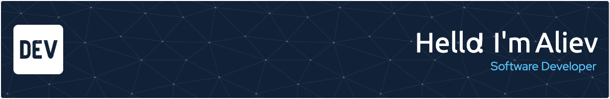

Hello

I'm Aliev, a software developer from Sweden, with Rust as my primary programming language. I began my career in embedded systems, spending five years developing my expertise. Over time, I’ve expanded my skills to include backend, frontend, embedded systems, cloud development, and DevOps. I also work with Golang, C, JavaScript, and TypeScript. At work, I primarily develop for Linux, handling everything from writing bash scripts to creating full-featured applications for the Linux environment.

 

## Pinned Repositories

 

 

 
 

## GitHub Stats

 

 
 

## Skills

 
